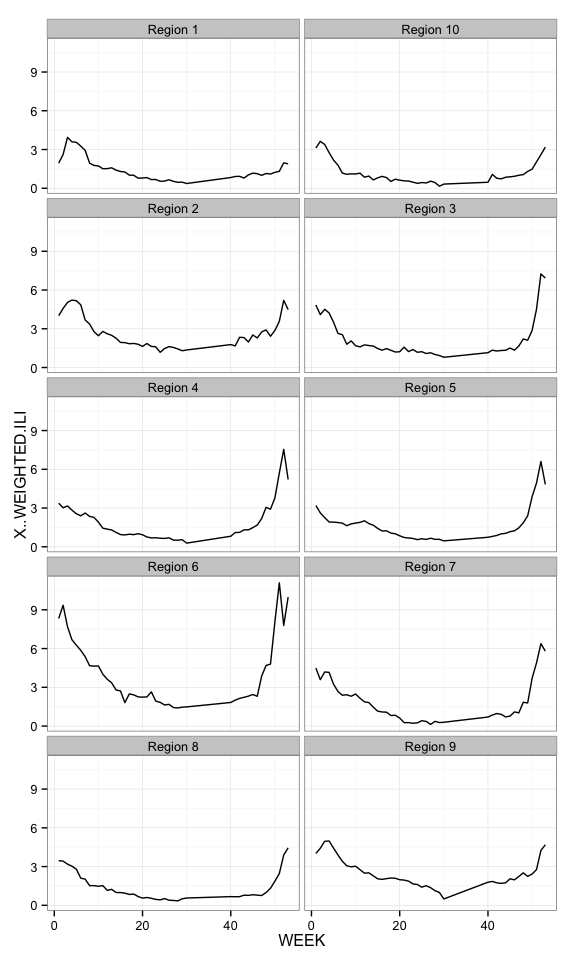
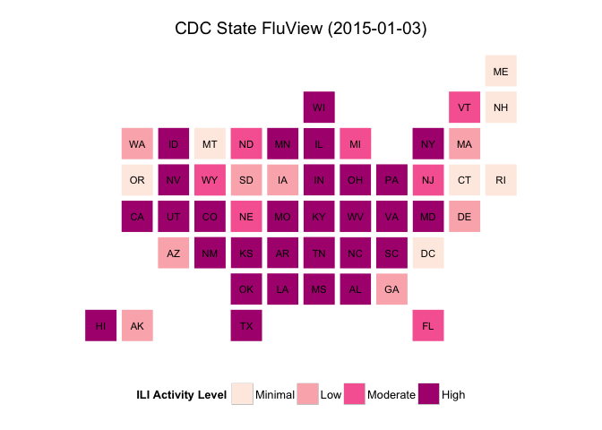

**NOTE** If there's a particular data set from <http://www.cdc.gov/flu/weekly/fluviewinteractive.htm> that you want and that isn't in the package, please file it as an issue and be as specific as you can (screen shot if possible).

------------------------------------------------------------------------

The CDC's FluView is a Flash portal and the only way to get flu season data is to use GUI controls, making it tedious to retrieve updates. This package uses the same API the portal does to programmatically retrieve data.

The following functions are implemented:

-   `get_flu_data` : retrieve flu data (national, by various region/sub-region types)
-   `get_state_data` : retrieve state-level flu data

The following data sets are included:

### News

-   Version 0.3 released : fix for the CDC API (it changed how year & region params are encoded in the request)
-   Version 0.2.1 released : bumped up `httr` version \# requirement in `DESCRIPTION` (via Issue [1](https://github.com/hrbrmstr/cdcfluview/issues/1))
-   Version 0.2 released : added state-level data retrieval
-   Version 0.1 released

### Installation

``` r
devtools::install_github("hrbrmstr/cdcfluview")
```

### Usage

``` r
suppressPackageStartupMessages(library(cdcfluview))
suppressPackageStartupMessages(library(ggplot2))
suppressPackageStartupMessages(library(dplyr))
suppressPackageStartupMessages(library(statebins))
suppressPackageStartupMessages(library(magrittr))

# current verison
packageVersion("cdcfluview")
```

    ## [1] '0.3'

``` r
flu <- get_flu_data("hhs", sub_region=1:10, "ilinet", years=2014)
glimpse(flu)
```

    ## Observations: 440
    ## Variables:
    ## $ REGION.TYPE       (chr) "HHS Regions", "HHS Regions", "HHS Regions", "HHS Regions", "HHS Regions", "HHS Regions",...
    ## $ REGION            (chr) "Region 1", "Region 2", "Region 3", "Region 4", "Region 5", "Region 6", "Region 7", "Regi...
    ## $ YEAR              (int) 2014, 2014, 2014, 2014, 2014, 2014, 2014, 2014, 2014, 2014, 2014, 2014, 2014, 2014, 2014,...
    ## $ WEEK              (int) 40, 40, 40, 40, 40, 40, 40, 40, 40, 40, 41, 41, 41, 41, 41, 41, 41, 41, 41, 41, 42, 42, 4...
    ## $ ILITOTAL          (int) 352, 2254, 1696, 1182, 1083, 1844, 220, 348, 1329, 61, 386, 2129, 1747, 1517, 1117, 2165,...
    ## $ TOTAL.PATIENTS    (int) 51688, 137157, 129302, 130419, 107261, 103975, 50272, 37014, 88421, 11172, 51169, 132513,...
    ## $ NUM..OF.PROVIDERS (int) 147, 285, 245, 305, 267, 241, 84, 117, 237, 55, 151, 274, 241, 310, 277, 250, 84, 114, 24...
    ## $ X..WEIGHTED.ILI   (dbl) 0.8306102, 1.7759176, 1.1477759, 0.8167958, 0.7370374, 1.8252298, 0.6970221, 0.6731439, 1...
    ## $ X.UNWEIGHTED.ILI  (dbl) 0.6810091, 1.6433722, 1.3116580, 0.9063097, 1.0096867, 1.7735032, 0.4376194, 0.9401848, 1...
    ## $ AGE.0.4           (int) 101, 869, 395, 333, 358, 465, 50, 82, 310, 22, 109, 837, 404, 356, 339, 560, 57, 58, 335,...
    ## $ AGE.5.24          (int) 185, 757, 629, 536, 400, 711, 98, 152, 577, 30, 199, 677, 670, 774, 443, 809, 124, 146, 5...
    ## $ AGE.25.64         (lgl) NA, NA, NA, NA, NA, NA, NA, NA, NA, NA, NA, NA, NA, NA, NA, NA, NA, NA, NA, NA, NA, NA, N...
    ## $ AGE.25.49         (int) 44, 363, 455, 187, 181, 469, 43, 87, 220, 7, 37, 349, 466, 249, 182, 509, 56, 87, 225, 20...
    ## $ AGE.50.64         (int) 13, 157, 127, 80, 80, 121, 15, 19, 110, 1, 24, 151, 132, 74, 105, 187, 18, 23, 118, 10, 2...
    ## $ AGE.65            (int) 9, 108, 90, 46, 64, 78, 14, 8, 112, 1, 17, 115, 75, 64, 48, 100, 14, 12, 103, 3, 9, 110, ...

``` r
state_flu <- get_state_data()
glimpse(state_flu)
```

    ## Observations: 2809
    ## Variables:
    ## $ STATENAME            (chr) "Alabama", "Alabama", "Alabama", "Alabama", "Alabama", "Alabama", "Alabama", "Alabama"...
    ## $ URL                  (chr) "http://adph.org/influenza/", "http://adph.org/influenza/", "http://adph.org/influenza...
    ## $ WEBSITE              (chr) "Influenza Surveillance", "Influenza Surveillance", "Influenza Surveillance", "Influen...
    ## $ ACTIVITY.LEVEL       (chr) "Level 1", "Level 1", "Level 1", "Level 1", "Level 1", "Level 1", "Level 5", "Level 10...
    ## $ ACTIVITY.LEVEL.LABEL (chr) "Minimal", "Minimal", "Minimal", "Minimal", "Minimal", "Minimal", "Low", "High", "High...
    ## $ WEEKEND              (chr) "Oct-04-2014", "Oct-11-2014", "Oct-18-2014", "Oct-25-2014", "Nov-01-2014", "Nov-08-201...
    ## $ WEEK                 (int) 40, 41, 42, 43, 44, 45, 46, 47, 48, 49, 50, 51, 52, 53, 1, 2, 3, 4, 5, 6, 7, 8, 9, 10,...
    ## $ SEASON               (chr) "2014-15", "2014-15", "2014-15", "2014-15", "2014-15", "2014-15", "2014-15", "2014-15"...

``` r
gg <- ggplot(flu, aes(x=WEEK, y=X..WEIGHTED.ILI, group=REGION))
gg <- gg + geom_line()
gg <- gg + facet_wrap(~REGION, ncol=2)
gg <- gg + theme_bw()
```



``` r
dat <- get_flu_data(region="hhs", 
                    sub_region=1:10, 
                    data_source="ilinet", 
                    years=2000:2014)
 
dat %<>%
  mutate(REGION=factor(REGION,
                       levels=unique(REGION),
                       labels=c("Boston", "New York",
                                "Philadelphia", "Atlanta",
                                "Chicago", "Dallas",
                                "Kansas City", "Denver",
                                "San Francisco", "Seattle"),
                       ordered=TRUE)) %>%
  mutate(season_week=ifelse(WEEK>=40, WEEK-40, WEEK),
         season=ifelse(WEEK<40,
                       sprintf("%d-%d", YEAR-1, YEAR),
                       sprintf("%d-%d", YEAR, YEAR+1)))
 
prev_years <- dat %>% filter(season != "2014-2015")
curr_year <- dat %>% filter(season == "2014-2015")
 
curr_week <- tail(dat, 1)$season_week
 
gg <- ggplot()
gg <- gg + geom_point(data=prev_years,
                      aes(x=season_week, y=X..WEIGHTED.ILI, group=season),
                      color="#969696", size=1, alpa=0.25)
gg <- gg + geom_point(data=curr_year,
                      aes(x=season_week, y=X..WEIGHTED.ILI, group=season),
                      color="red", size=1.25, alpha=1)
gg <- gg + geom_line(data=curr_year, 
                     aes(x=season_week, y=X..WEIGHTED.ILI, group=season),
                     size=1.25, color="#d7301f")
gg <- gg + geom_vline(xintercept=curr_week, color="#d7301f", size=0.5, linetype="dashed", alpha=0.5)
gg <- gg + facet_wrap(~REGION, ncol=3)
gg <- gg + labs(x=NULL, y="Weighted ILI Index", 
                title="ILINet - 1999-2015 year weighted flu index history by CDC region\nWeek Ending Jan 3, 2015 (Red == current season)\n")
gg <- gg + theme_bw()
gg <- gg + theme(panel.grid=element_blank())
gg <- gg + theme(strip.background=element_blank())
gg <- gg + theme(axis.ticks.x=element_blank())
gg <- gg + theme(axis.text.x=element_blank())
```


``` r
gg_s <- state_flu %>%
  filter(WEEKEND=="Jan-03-2015") %>%
  select(state=STATENAME, value=ACTIVITY.LEVEL) %>%
  filter(!(state %in% c("Puerto Rico", "New York City"))) %>% # need to add PR to statebins
  mutate(value=as.numeric(gsub("Level ", "", value))) %>%
  statebins(brewer_pal="RdPu", breaks=4, 
            labels=c("Minimal", "Low", "Moderate", "High"),
            legend_position="bottom", legend_title="ILI Activity Level") +
  ggtitle("CDC State FluView (2015-01-03)")
```



### Test Results

``` r
suppressPackageStartupMessages(library(cdcfluview))
suppressPackageStartupMessages(library(testthat))

date()
```

    ## [1] "Sat Aug  8 14:09:26 2015"

``` r
test_dir("tests/")
```

    ## testthat results ========================================================================================================
    ## OK: 0 SKIPPED: 0 FAILED: 0
    ## 
    ## DONE
